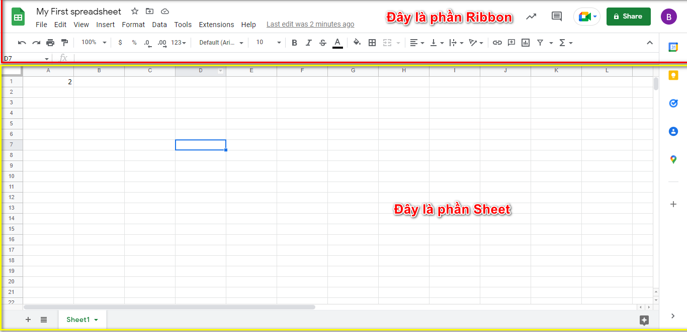

# Google Sheets Tutorial

Syntax Different depend on the language. [Read more](https://www.benlcollins.com/spreadsheets/sheets-location/)
So, I will just explain the syntax of VietNam language.

## Why Study Google Sheets?

Google Sheets is an widely used spreadsheet program.

Example use areas:

- Data analytics
- Project management
- Finance and accounting

## Google Sheets Get Started

### Google Sheets

Google Sheets does not require downloading and installation of the program. It simply runs in your browser.

Google Sheets can be accessed from [link](https://docs.google.com/spreadsheets/.)

## Google Sheets Overview

### Overview

This chapter gives an overview of Google Sheets. Google Sheets are made of two pieces, the Ribbon and the Sheet.

Image:
    

#### The Ribbon

The **Ribbon** provides shortcuts to Google Sheets commands. A command is an action that allows you to make something happen. This can for example be to: insert a chart, change the font size, or to change the color of a cell.

The **Ribbon** is made up(tạo thành) of the **Sheets Home, Menu bar, Quick Access Toolbar, Groups and Commands**.

Image:
    

##### Sheets Home

The Sheets Home button takes you to Google Sheets start page where you can create new workbooks or visit your Previous workbooks.

##### Menu Bar

The menu bar allows you to perform different actions on your workbook.

##### Quick Access Toolbar

The quick access toolbar has the most popular actions from the menu.

##### Groups

The groups are sets of related commands on the quick access toolbar. The groups are separated by the thin vertical line break.

##### Commands

The commands are the buttons that you use to do actions.

#### The Sheet

**The Sheet** is a set of rows and columns. It forms the same pattern as we have in math exercise books, the rectangle boxes formed by the pattern are called **cells**.

Values can be typed to cells.

Values can be both numbers and letters

> Each cell has its unique reference(tham chiếu duy nhất) which is its coordinates. This is where the columns and rows intersect(giao nhau).

Have a look at the picture below. "Hello world" was typed in cell `B2`. The reference can be found by clicking on the relevant(liên quan) cell and seeing the reference in the **Name Box** to the left, which tells you that the cell's reference is `B2`

Example:
    

Another way to find the reference is to first find the column, in this case `B`, then map that towards(đối với) the row, in this case `2`, which gives us the reference of `B2`.

**Note**: The reference of the cell is its coordinates(tọa độ). For example, `B2` has the coordinates of column `B` and row `2`. You find the cell in the intersection of the two. The letter is always the column and the number is always the row.

### Multiple Sheets

You start with one **Sheet** by default when you create a new workbook. You can have many sheets in a workbook. New sheets can be added or removed. Sheets can be named to making it easier to work with data sets.

Steps to add a new sheet:

- First, click the plus icon, shown in the picture below, create two new sheets

**Tip**: Use the hotkey `Shift + F11` to create new sheets

- Second, right click with your mouse on the relevant sheet and click rename

- Third, enter useful names for the three sheets

## Syntax

A formula in Google Sheets is used to do mathematical calculations. Formulas always start with the equal sign `=` typed in the cell, followed by your calculation.

**Note**: You claim the cell by selecting it and typing the equal sign (=)

## Google Sheets Ranges

There are four different operations for selection;

### Selecting a cell

Cells are selected by clicking them with the left mouse button or by navigating(điều hướng) to them with the keyboard arrows(mũi tên)

### Selecting multiple cells

More than one cell can be selected by pressing and holding down **Ctrl or Command** and left clicking the cells. Once finished with selecting, you can let go of **Ctrl or Command**.

### Selecting a column

Columns are selected by left clicking on them. This will select **all** cells in the sheet related to the column.

### Selecting a row

Rows are selected by left clicking on them. This will select **all** the cells in the sheet related to that row.

### Selecting the Entire Sheet

[Video Example](https://drive.google.com/file/d/1uHOBcD_2xVh9mjuskWMOZ4eYzH3P4G3k/view?usp=sharing)

**Note**: You can also select the entire spreadsheet by pressing **Ctrl+A** for Windows, or **Command+A** for MacOS.

### Selection of Ranges

Selection of cell ranges has many use areas and it is one of the most important concepts of Google Sheets.

There are three ways to select a range of cells

Example: Selecting a range of cells from `A1` to `E10`

1. Name Box

    [Video Example](https://drive.google.com/file/d/12jfrXCjY8N_SbZbfFUmHXESB6tSBMzt-/view?usp=sharing)

2. Drag to mark a range

    [Video Example](https://drive.google.com/file/d/1uqRnnvEKOTZVF_fZTwocukM24uc-XdL4/view?usp=sharing)

3. Using the Shift key

    [Video Example](https://drive.google.com/file/d/1IjnqrLTxHdAS4CpPxpjjJ4shLka3SyVW/view?usp=sharing)

## Google Sheets Fills

Filling can be used for:

- Copying
- Sequences
- Dates
- Functions

### How to Fill

Filling is done by selecting a cell, clicking the fill icon and selecting the range using drag and mark while holding the left mouse button down.

The fill icon is found in the button right corner of the cell and has the icon of a small square. Once you hover over it your mouse pointer will change its icon to a thin cross.

Click the fill icon and hold down the left mouse button, drag and mark the range that you want to cover.

### Fill Copies

Filling can be used for copying. It can be used for both numbers and words.

[Video Example](https://drive.google.com/file/d/1kzI04dUj97oa03oDUqcZbwJPEimvOw99/view?usp=sharing)

### Fill Sequences

Filling can be used to create sequences. A sequence is an order or a pattern. We can use the filling function to continue the order that has been set.

Sequences can for example be used on numbers and dates.

[Video Example](https://drive.google.com/file/d/14NGKgT7wzai4pWN3vVXv6FslgvsPTpL8/view?usp=sharing)

### Sequence of Dates

#### Date Format

The date format in Google Sheets is a standard way provided by Google Sheets to express a particular(cụ thể) period of the day (D), month (M), and year (Y) in a numeric calendar date, which helps you eliminate ambiguity(sự mơ hồ)

- Day can be written
  - In numbers (one or two digits) as the day of month, for example, `2` or `12`
  - Abbreviated day of the week (three digits), for example, `Tue`
  - Full day name of the week, for example, `Tuesday`
- Month can be written
  - In numbers (one or two digits) as the month in year, for example, `1` or `12`
  - Abbreviated month (three digits), for example, `Apr`
  - Full month name, for example, `April`
- Year can be written
  - in two or four digits, for example, `21` or `2021`.

The separators(dải phân cách) you can use between the components are slash (`/`), dot (`.`), dash (`-`), and space ( )  

Google Sheets has many options to help meet your unique circumstances(trường hợp). When you do this, you have two choices:

- Use the default formats

Default formats here mean the default/specific(mặc định / cụ thể) date formats that are used in your region/country. Suppose you live in the UK, then the default date format that you can use is DD/MM/YYYY – 24/04/1997, for example.

- Create a custom format

With this choice, you are free to define the date format, as long as the format meets the criteria(tiêu chuẩn) in Google Sheets. For example, after the date format MM-DD-YYYY, you want to add hh:mm as a two-digit number for the hour and a two-digit number for the minute – 04-15-2017 10:14 AM.

So, Google Sheets location is a setting in Google Sheets that controls how to enter number values (such as date-time values) into Google Sheets

[Video Example](https://drive.google.com/file/d/1OtTn29ZJqTwDM_r-QDtkboItDE0nvNFC/view?usp=sharing)

### Combining Words and Letters

[Video Example](https://drive.google.com/file/d/1hkSQ372qK_jCrN6reXnWZTXL_MUYhPH6/view?usp=sharing)

## Google Sheets Relative and Absolute References

Cells in Google Sheets have unique references(tham chiếu duy nhất), which is their location.

References are used in formulas to do calculations, and the fill function can be used to continue formulas sidewards(sang bên cạnh), downwards(xuống dưới) and upwards(lên trên).

Google Sheets have two types of references:

1. Relative references
2. Absolute references

Absolute reference is a choice we make. It is a command which tells Google Sheets to lock a reference.

The dollar sign (`$`) is used to make references absolute.

Example of relative reference: `A1`
Example of absolute reference: `$A$1`

### Relative reference

References are relative by default, and are without dollar sign ($).

The relative reference makes the cells reference free. It gives the fill function freedom to continue the order without restrictions(hạn chế).

[Video Example](https://drive.google.com/file/d/16c3ganh3_W4Cn9h_AAOXKMSWeL01nRwS/view?usp=sharing)

### A Non-Working Example

Let's try an example that will not work.

[Video Example](https://drive.google.com/file/d/1j7wcSbHMC3NQ3sY82ar7djytenOVTzmq/view?usp=sharing)

### Absolute References

Absolute reference is when a reference has the dollar sign (`$`).

It locks a reference in the formula.

Add `$` to the formula to use absolute references.

The dollar sign has three different states:

- Absolute for column and row. The reference is absolutely locked.

Example =`$A$1`

- Absolute for the column. The reference is locked to that column. The row remains relative.

Example =`$A1`

- Absolute for the row. The reference is locked to that row. The column remains relative.

Example =`A$1`

[Video Example](https://drive.google.com/file/d/1DaKtO91gl3Q0_lWoZV_xRcfa5zhVTvS_/view?usp=sharing)

## Google Sheets Formatting

There are two ways to access the styling commands in Google Sheets:

1. The Ribbon
2. Format menu

**Note**: Formatting can be applied to any range.

### Styling Commands in Ribbon

### Styling Commands in Format menu

## Google Sheets Format Painter

The format painter is a command which lets you copy formatting from one cell to another.

Format Painter is used by clicking on its button in the Ribbon.

### Copy and Paste Color to Multiple Cells

[Video Example](https://drive.google.com/file/d/1Fhsy2CPS4PCIsHjJlTZx26YzW4ASIQ4W/view?usp=sharing)

### Copy Font Characteristics

[Video Example](https://drive.google.com/file/d/1oXLrxxkQY-wonYHW4X6mqMUdAu4-4agV/view?usp=sharing)

## Google Sheets Format Colors

Colors are specified by selection or by using Hexadecimal (HEX) codes.

## Google Sheets Font Characteristics

Apply different characteristics to fonts such as:

- Bold
- Italic
- Underlined
- Strike though

The commands can be found below in the **Format** menu or on the **Quick Access Toolbar**

## Google Sheets Format Numbers

### Number Formats

The default Number format is **Automatic**

Examples of number formats:

- Automatic
- Number
- Currency
- Time

Number formats can be changed by clicking the Number format dropdown, accessed in the Ribbon, found in the Numbers group.

**Note**: Google Sheets uses the local currency defined in the [location setting](https://www.w3schools.com/googlesheets/google_sheets_location_settings.php).

## Decimals

The number of decimals can be increased and decreased.

There are two commands:

Increase Decimal ()
Decrease Decimal ()

The commands can be found next to the Number format dropdown menu.

**Note**: Decreasing Decimals can make Google Sheets round(làm tròn) up or down numbers as more decimals get removed. This may be confusing(gây nhầm lẫn) if you are working on advanced calculations which require accurate(chính xác) numbers.

**Pro tip**: The rectangle in the top left corner by `row 1` and `column A` can be clicked to select all cells in the sheet. This can be useful if you want to change the Number format or change Decimals for all cells.

## Google Sheets Format Gridlines(đường lưới)

By default, gridlines are displayed in Google Sheets.
However, gridlines can be removed.

[Video Example](https://drive.google.com/file/d/151RAdpQLAt7pw3jjShQGb1TeSomR-7JG/view?usp=sharing)

**Note**: Removing gridlines, applies to all cells in the sheet.

## Google Sheets Clear Format

Google Sheets lets you remove **all** formatting operations on a selected range.

The **Clear Formatting** command can be found in the **Format** menu.

## Google Sheets Sort

Google sheets has commands for sorting the data in **Ascending** or **Descending** order.

**Ascending**: from the smallest to the largest for numbers and from A to Z for text.

**Descending**: from the largest to the smallest for numbers and from Z to A for text.

The sort commands can be found in the **Data** menu.

## Google Sheets Sort Sheet By Column

Sorting a sheet by column **preserves** the relation between multiple data columns.

**Note**: This method works if your data no **headers**

[Video Example](https://drive.google.com/file/d/1WUiFEeonYYASDzG0KXLJHanSJAmniA2d/view?usp=sharing)

### Sort Sheet By Column Non-Working Example

[Video Example](https://drive.google.com/file/d/1LbkeXIf5ln6VltwZvBiqPq4asYy6DQwZ/view?usp=sharing)

## Google Sheets Sort Range By Column

**Note**: To sort a range that has more than one column, the whole range of data has to be selected. Sorting just one can breaks the relationship between columns.

[Video Example](https://drive.google.com/file/d/1RbNcBZih2bclpsZP8kSoKvVumxeZGj-A/view?usp=sharing)

### Sort Range By Column Non-Working Example

Sorting column by range can break the relationship between multiple data columns.

[Video Example](https://drive.google.com/file/d/13r23f0eSugmEQstFxrheszS9gTxTiUEy/view?usp=sharing)

## Google Sheets Sort Range

The **Sort Range** command in Google Sheets allows for more complex sorting of data.

For example it can work with data which has headers or have multiple sort rules.

### Handling Data with Headers

[Video Example](https://drive.google.com/file/d/1SeGgSlkekytMSOtuZ7xrNO-IcswgDNeL/view?usp=sharing)

### Multi-Level Sorting

Sort the Pokemon in the range by their Total stats, ascending from smallest to largest (A-Z) and then sort the results based on their Name.

[Video Example](https://drive.google.com/file/d/1t9_My_LBXdDFwuIaKl7SgCp6q2VVOZ07/view?usp=sharing)

## Google Sheets Conditional Formatting

Conditional formatting is used to change the **appearance** of cells in a range based on your specified **conditions**.

The conditions are rules based on specified numerical values, matching text and more.

Google Sheet provides a number(một số) of preset formatting options, as well as customizable format options and conditions.

The two main Conditional Formatting options are:

- Single Color formatting applies a single customizable formatting option to all the cells that match a condition.

- Color Scale formatting applies a background color that smoothly(mượt mà) changes between 2 or 3 colors based on the values of cells in a range.

**Note**: Single Color formatting lets you customize **both** the background color and the font in the cells.

### Google Sheets Single Color Formatting

#### Single Color Formatting

Single Color is a premade(tạo sẵn) type of conditional formatting in Google Sheets used to apply a customizable formatting option to all the cells that match a condition.

You can access the menu by selecting the **Conditional formatting** option in the **Format** menu

##### Single Color Options

From the conditional format rules menu you can choose:

- Which cells the conditional formatting applies to
- Which format rule is used
- The formatting style

###### Apply to range (Single Color Options)

In the **Apply to range** field you can enter the cells and ranges that the Single Color applies to.

You can enter cells and ranges separated by a comma `,` into the field.

[Video Example](https://drive.google.com/file/d/1YVpvllLUyUeYYSJY_MdJ17--VV-G3PD-/view?usp=sharing)

###### Format rules

There are many options:

- Empty or not Empty cells
- Text Contains or not Contains
- Text Starts or Ends with
- Text is Exactly
- Calendar Dates
- Greater than
- Less than
- Equal to
- Between or not Between
- Custom rules

###### Formatting style

The Single Color formatting lets you customize both the background color and the font of the cells.

### Google Sheets Color Scale Formatting

#### Color Scale Formatting

Color Scales are premade types of conditional formatting in Google Sheets used to highlight(đánh dấu) cells in a range to indicate how large or small the cell values are.

You can access the menu by selecting the **Conditional formatting** option in the **Format** menu

##### Color Scale Options

From the conditional format rules menu you can choose:

- Which cells the color scale applies to
- What colors the scale uses
- The min, mid, and max points

###### Apply to range (Color Scale Options)

In the **Apply to range** field you can enter the cells and ranges that the color scale applies to.

You can enter cells and ranges separated by a comma `,` into the field.

###### Custom color scale

ou can customize the color scale by selecting min/mid/max point color icons on the right-hand side

Example: [Video Example](https://drive.google.com/file/d/1XLTY5QDGQWuhJQ35mQgfr6vA_Bw28cvV/view?usp=sharing)

> Nếu chọn `number` cho `minpoint` và `maxpoint`. Thì những giá trị nhỏ hơn `minpoint` sẽ được đánh dấu với màu `minpointcolor` và những giá trị lớn hơn `maxpoint` sẽ được đánh dấu với màu `maxpointcolor`.

## Google Sheets Function

### AND Function

The **AND** function is a premade function in Google Sheets, which returns **TRUE** or **FALSE** based on two or more **conditions**.

Syntax: `=AND([logical_expression1]; [logical_expression2, ...])`

The conditions are referred to as `[logical_expression1]; [logical_expression2]`, and so on.

The conditions can check things like:

- If a number is **greater than** another number `>`
- If a number is **smaller than** another number `<`
- If a number or text is **equal** to something `=`

### AVERAGE Function

The **AVERAGE**(trung bình) function is a premade function in Google Sheets, which calculates the average (arithmetic mean).

Syntax:`=AVERAGE(value1; [value2, ...])`

[Video Example](https://drive.google.com/file/d/1d9wSMFPVhu4Zce8X-zdag_ZlkkNK677s/view?usp=sharing)

### AVERAGEIF Function

The **AVERAGEIF** function is a premade function in Google Sheets, which calculates the average of a range based on a **true** or **false** condition.

Syntax: `=AVERAGEIF(criteria_range; criterion; [average_range])`

The condition is referred to as criterion, which can check things like:

- If a number is **greater than** another number `>`
- If a number is **smaller than** another number `<`
- If a number or text is **equal** to something `=`

[Video Example](https://drive.google.com/file/d/1AYOCjzN6l-68WWOsdVqX6NgVdHocbz5f/view?usp=sharing)

### AVERAGEIFS Function

The **AVERAGEIFS** function is a premade function in Google Sheets, which calculates the average of a range based on one or more **true** or **false** condition.

Syntax: `=AVERAGEIFS(average_range; criteria_range1; criterion1; ...)`

The **conditions** are referred to as `criterion1, criterion2, ..` and so on, which can check things like:

- If a number is **greater than** another number `>`
- If a number is **smaller than** another number `<`
- If a number or text is **equal** to something `=`

### COUNT Function

The **COUNT** function is a premade function in Google Sheets, **which counts cells with numbers**.

Syntax: `=COUNT(value1; [value2, ...])`

[Video Example](https://drive.google.com/file/d/18xkyfLB4wBanFtI_yryvCGs43ScqcSEk/view?usp=sharing)

### COUNTA Function

The **COUNTA** function is a premade function in Google Sheets, which counts cells that has values, **both letters and numbers**.

Syntax: `=COUNTA(value1; [value2, ...])`

### COUNTBLANK Function

The **COUNTBLANK** function is a premade function in Google Sheets, which counts blank cells in a range.

Syntax: `=COUNTBLANK(value1; [value2, ...])`

> **Note**: The **COUNTBLANK** function is helpful to find empty cells in a range.

### COUNTIF Function

The **COUNTIF** function is a premade function in Google Sheets, which counts cells that match a specified **condition**.

Syntax: `=COUNTIF(range; criterion)`

The **condition** is referred to as `criterion`, which can check things like:

- If a number is **greater than** another number `>`
- If a number is **smaller than** another number `<`
- If a number or text is **equal** to something `=`

### COUNTIFS Function

The **COUNTIFS** function is a premade function in Google Sheets, which counts cells in a range based on one or more **true** or **false** condition.

Syntax: `=COUNTIFS(criteria_range1; criterion1; [criteria_range2, ...]; [criterion2, ...])`

The **conditions** are referred to as `critera1, criteria2, ..` and so on, which can check things like:

- If a number is **greater than** another number `>`
- If a number is **smaller than** another number `<`
- If a number or text is **equal** to something `=`

[Video Example](https://drive.google.com/file/d/1i0AWXiaaexIMbHMRoctRtL2PRkuTGLlR/view?usp=sharing)

### IF Function

The **IF** function is a premade function in Google Sheets, which returns values based on a **true** or **false condition**.

Syntax: `=IF(logical_expression; value_if_true; value_if_false)`

The **condition** is referred to as `logical_expression`, which can check things like:

- If a number is **greater than** another number `>`
- If a number is **smaller than** another number `<`
- If a number or text is **equal** to something `=`

### IFS Function

Syntax: `=IFS(logical_test1; value_if_true1; [logical_test2; value_if_true2]; [logical_test3; ...)`

### MAX Function

Syntax: `=MAX(value1; [value2, ...])`

### MIN Function

Syntax: `=MIN(value1; [value2, ...])`

### MEDIAN Function

Returns the middle value in the data.

Syntax: `=MEDIAN(value1; [value2, ...])`

### MODE Function

Find the most common value(s).

There are two versions, which are typed `MODE.SNGL` or `MODE.MULT`

Syntax:

- `=MODE.SNGL(value1; [value2, ...])`
  
- `=MODE.MULT(value1; [value2, ...])`

`MODE.SNGL` does the same as MODE and returns only one value (picking the first it finds).
`MODE.MULT` returns multiple values if there are more than one that is the most common.

[Video Example](https://drive.google.com/file/d/17OqgOhEi0_6AUnj3fpalbwj9hw-ymZ1J/view?usp=sharing)

### OR Function

Returns **TRUE** or **FALSE** based on **two or more conditions**.

Syntax: `=OR(logical_expression1; [logical_expression2, ...])`

The **condition** is referred to as `logical_expression`, which can check things like:

- If a number is **greater than** another number `>`
- If a number is **smaller than** another number `<`
- If a number or text is **equal** to something `=`

### STDEV.P Function

Calculates the **Standard Deviation (Stdev) for the entire population**.

Syntax: `=STDEV.P(value1, [value2, ...])`

### STDEV.S Function

Calculates the **Standard Deviation (Stdev) for a sample of a population**.

Syntax: `=STDEV.S(value1, [value2, ...])`

### SUM Function

Adds up numbers in a range.

Syntax: `=SUM(value1, [value2, ...])`

### SUMIF Function

Calculates the sum of values in a range based on a **true or false condition**.

Syntax: `=SUMIF(range, criterion, [sum_range])`

The **condition** is referred to as `criterion`, which can check things like:

- If a number is **greater than** another number `>`
- If a number is **smaller than** another number `<`
- If a number or text is **equal** to something `=`

### SUMIFS Function

Calculates the sum of a range based on one or more   **true or false condition**.

Syntax: `=SUMIFS(sum_range, criteria_range1, criterion1, [criteria_range2, ...], [criterion2, ...]`

The **condition** is referred to as `criteria1`, `criteria2`,and so on which can check things like:

- If a number is **greater than** another number `>`
- If a number is **smaller than** another number `<`
- If a number or text is **equal** to something `=`

### VLOOKUP Function

[Link](https://www.w3schools.com/googlesheets/google_sheets_vlookup.php)

Syntax: `=VLOOKUP(search_key, range, index, [is_sorted])`

**search_key**: Select the cell where search values will be entered.

**range**: The table range, including all cells in the table.

**index**: The data which is being looked up. The input is the number of the column, counted from the left:

**[is_sorted]**: TRUE/1 if the range is sorted or FALSE/0 if it is not sorted.

**Note**: The column which holds the data used to lookup must always be to the left.

### XOR Function

Returns **TRUE** or **FALSE** based on two or more conditions.

Syntax: `=XOR(logical_expression1, [logical2_expression, ...])`

The **condition** is referred to as `[logical_expression1]`, `[logical_expression2]`,and so on which can check things like:

- If a number is **greater than** another number `>`
- If a number is **smaller than** another number `<`
- If a number or text is **equal** to something `=`

## Google Sheets Function Advance

### Array

Arrays in Google Sheets are collections of data, consisting of rows and columns. You can use arrays in formulas in the same way that you use regular A1-type ranges.

You construct arrays in Google Sheets with curly brackets: `{ }`

#### How To Create Arrays In Google Sheets

#### Row Array

Example: `={1\2\3}`

The opening and closing curly brackets denote(chứng tỏ) the array.

**Back slash**(dấu gạch chéo) separate the data into columns.

#### Column Array

Example: `={1;2;3}`

**Semi-colons**(dấu chấm phẩy) create new rows in the array.

#### Two Dimensional Array

Example: `= {"A"\1; "B"\2; "C"\3}`

### ARRAYFORMULA Function

#### Problems

Let’s imagine a situation where you’ve got 2 columns in a Google spreadsheet: the 1st with prices, the 2nd with the number of items, and you need to multiply them in the 3rd column. What do you usually do in this case? If you were like me in the past, you’d compose a formula in the first row and copy-paste it into the other rows. A good old-school method that works fine.

But what if there are 1000 rows or even more? Annoying, right? Let alone time-consuming. It can also cause a performance issue since a bunch of similar formulas slow down the whole spreadsheet. And, if you need to add a new value and create a separate row for it, Google Sheets will not automatically copy the formula.

#### What is ARRAYFORMULA?

In short(tóm lại), ARRAYFORMULA is a function that outputs a range of cells instead of just a single value and can be used with non-array functions.

Syntax: `=ARRAYFORMULA(array_formula)`

`array_formula` is a parameter that can be

- a range
- a mathematical expression using ranges of the same size, or
- a function that returns a result greater than one cell

[Video Example](https://drive.google.com/file/d/1BRuFP82kYWOvEpQJ_6k06vVu3eO7LrC3/view?usp=sharing)

### Access other sheets in a spreadsheet Method (Get data from other sheets in your spreadsheet)

Syntax: `'NameSheet'!Range`

`'NameSheet'` is the name of the sheet you want to access.

`Range` is the range you want to access.

[Video Example](https://drive.google.com/file/d/1_NclOD46-IEOrOr7Vpw_Xt1D1xEWuWRm/view?usp=sharing)

#### Using Defined Named Range

[Video Example](https://drive.google.com/file/d/1rGqvKElhjD0tKeRBenR4ntdB1VRZMfy2/view?usp=sharing)

### IMPORTRANGE Function (Get data from other spreadsheets)

Managing several spreadsheets at once. Use the IMPORTRANGE function in Google Sheets to easily copy data from one spreadsheet to another.

Syntax: `=IMPORTRANGE([spreadsheet_url], [range_string])`

- **spreadsheet_url**: This is just the URL or web address of the spreadsheet you want to import data from. You actually(thực ra) have an option here: You can use the entire(toàn bộ) URL, or just what's known as the spreadsheet key. More on that in a moment.

- **range_string**: This is the specific cells in the original spreadsheet you want to import and sync(đồng bộ hóa) with the new spreadsheet

### Query Function

It allows you to use data commands(lệnh) to manipulate(thao tác) your data in Google Sheets, and it’s incredibly(vô cùng) versatile(linh hoạt) and powerful.

This single function does the job of many other functions and can replicate most of the functionality of pivot tables.

Syntax: `= QUERY(data; query; [headers])`

- `data`: The range of cells to perform the query on.
- `query`: The query to perform, written in the Google Visualization API Query Language.
- `headers` **- [optional]**: The number of header rows at the top of 'data'. If omitted or set to -1, the value is guessed based on the content of 'data'.

#### SELECT Keyword

##### SELECT All

The statement `SELECT *` retrieves(lấy lại) all of the columns from our data table.

##### SELECT Specific Columns

Syntax: `=QUERY(data;"SELECT Coloumn[1], Coloumn[2],...";[headers])`

Columns: A,B,C...

#### WHERE Keyword

The **WHERE** keyword specifies(chỉ định) a condition that must be satisfied(hài lòng). It filters(lọc) our data. It comes after the SELECT keyword.

Modify your Google Sheets QUERY function to select only countries that have a population greater than 100 million:

Syntax: `=QUERY(countries,"SELECT B, D WHERE D > 100000000",1)`

Can use And, Or, Not, and parentheses to create complex conditions.

#### ORDER BY Keyword

The ORDER BY keyword sorts our data. We can specify the column(s) and direction (ascending or descending). It comes after the SELECT and WHERE keywords.

**ASC**: specifying an ascending direction
**DESC**: specifying an descending direction

Example:

- `=query(countries,"SELECT B, D WHERE D > 100000000 ORDER BY D ASC",1)`
- `=query(countries,"SELECT B, D WHERE D > 100000000 ORDER BY D DESC",1)`

But, sometime use ORDER BY using to sort ascending is error. Can replace it: `where [nameColumn] is not null order by [nameColumn]`
[Read to know more about problem it](https://blog.coupler.io/google-sheets-query-function/#Google_Sheets_Query_ORDER_BY_ascending_or_descending)

#### LIMIT Keyword

The LIMIT keyword restricts(hạn chế) the number of results returned. It comes after the SELECT, WHERE, and ORDER BY keywords.

Example: `=QUERY(countries,"SELECT B, C, D ORDER BY D ASC LIMIT 10",1)`. It will return the first 10 rows.

#### Arithmetic Functions

We can perform(thực hiện) standard math operations on numeric columns.

So let’s figure out(tính toán) what percentage of the total world population (7.16 billion) each country accounts for.

Example: We’re going to divide the population column by the total (7,162,119,434) and multiply by 100 to calculate percentages. So, modify our formula to read:
`=QUERY(countries,"SELECT B, C, (D / 7162119434) * 100",1)`

#### LABEL Keyword

That heading for the arithmetic(số học) column is pretty(khá) ugly(xấu) right? Well, we can rename it using the LABEL keyword, which comes at the end of the QUERY statement

Example: `=QUERY(countries,"SELECT B, C, (D / 7162119434) * 100 LABEL (D / 7162119434) * 100 'Percentage' ",1)`

#### Aggregation Functions

We can use other functions in our calculations, for example, min, max, and average.

[Video Example](https://drive.google.com/file/d/1OGoaI17NZF1wtpgUZyDJpTmleJVCedlr/view?usp=sharing)

#### LIKE Keyword

The LIKE string operator in Google Sheets Query is useful for complex string comparisons(sự so sánh). You can use the Like comparison operator in the **Query Where Clause**. It enables the use of two wildcards(ký tự đại diện) in Google Sheets Query.

**Important Note**:

- The LIKE String Operator in Google Sheets Query is case sensitive(phân biệt chữ hoa chữ thường). But you can make that case-insensitive with a workaround(cách giải quyết) that using the scalar functions Lower and Upper.
- LIKE is a string comparison operator.
- The LIKE string operator brings the wildcard support to Query. The supporting wildcards are % (percentage) and _ (underscore)(gạch dưới).

##### The Use of % (Percentage) Wildcard in Query (Alternative to Asterisk(dấu hoa thị))

You can use the percentage wildcard in the LIKE operator to match zero or more characters of any kind.

Formula 1:

`=query(A2:A,"Select A where A like '%'")`
It’s just like using the wildcard character *. It **returns all** the country names in column A as it’s.

Formula 2:

`=query(A2:A,"Select A where A like 'A%'")`
Result:

Australia
Austria
Auckland

What does it mean? It means, the percentage wildcard in LIKE returns all the strings starting with the letter “A”. See this example.

Formula 3:

`=query(A2:A,"Select A where A like '%land'")`

Result:

- Oakland
- Auckland

Formula 4:

`=query(A2:A,"Select A where A like 'Sl%ia'")`
Result:

Slovakia
Slovenia

##### The Use of _ (Underscore) Wildcard in Query (Alternative to Question Mark(dấu chấm hỏi))

For example;

- `=query(A2:A,"Select A where A like 'Am_'")`
  This would return the names like Ami, Amy, etc.

- `=query(A2:A,"Select A where A like 'A__'")`
In this formula, I’ve used double underscore. It can return the names like Ann, Ash, etc.

Finally, if you want to make the above(trên) formulas case-insensitive, please follow the below logic.

`=query(A2:A,"Select A where lower(A) like 'a__'")`
See how I’ve used the `lower()` scalar function in the formula.

#### GROUP BY Keyword

[Read](https://www.benlcollins.com/spreadsheets/google-sheets-query-sql/)

### INDIRECT function

[Read](https://blog.sheetgo.com/google-sheets-formulas/indirect-formula-google-sheets/)

### SUMPRODUCT Function

[Read](https://blog.sheetgo.com/google-sheets-formulas/sumproduct-formula-google-sheets/)

### Make a Drop Down in Google Sheets

`Menu` -> `Data` -> `Data Validation`

### Pivot Tables

With huge(khổng lồ) amounts of data, it can be challenging to come up(đưa ra) with clear-cut(rõ ràng) conclusions(kết luận) or summarize information from a simple spreadsheet table view.

That’s why pivot tables are important.

[Video Tutorial](https://www.youtube.com/watch?v=T98RwlndSZk&list=PLv9Pf9aNgemtP-BeFvg78PJFxKs6xDgea&index=8)

### Index Function

The INDEX function in Google Sheets returns the value of a cell within an input range, relatively(tương đối) separated(phân tách) from the first cell by row and column offsets(Số hiệu). This is similar to the index at the end of a book, which provides a quick way to locate specific content.

Syntax: `=INDEX(reference; [row_offset]; [column_offset])`

- reference – the address of the range of cells within which the offset is evaluated from the very first cell (on the top left). Accordingly, the INDEX formula returns the value of the offset target cell.
- row_offset – the number of rows to offset from the starting cell.
- column_offset – the number of columns to offset from the starting cell.

**Note**: Are there any cases where INDEX function might throw up an error? Of course, yes! When you try to point the function away from the confines of the input range, it does cough up an error

#### Combination with other formulas

##### INDEX function and COUNTA function

##### Another Problem with INDEX function

[Read](https://blog.sheetgo.com/google-sheets-formulas/index-formula-google-sheets/#:~:text=The%20INDEX%20function%20in%20Google%20Sheets%20returns%20the%20value%20of,way%20to%20locate%20specific%20content.)

##### MATCH and INDEX functions

### Match Function

In Google Sheets, the **MATCH** function gives you the **relative position** of an item within(ở trong) a range of cells. Basically(về cơ bản), if you want to know the position of a specific value within a range or array, **MATCH** will tell you where it’s located

Remember that MATCH returns a position but not a value, so if you want to return a value itself, use **INDEX**, **HLOOKUP**, or **VLOOKUP**.

Syntax: `=MATCH(search_key, range, search_type)`

- **search_key** – is the item that the MATCH function searches for within the range of cells. It can be a pure text (‘Evan’), or a cell reference (like A7), or even a function that returns a string or a number (like LEFT(“Mike Johnson”,8) or DATE(2017,1,1))
- **range**
- **search_type** – is an optional input that directs how the MATCH function should search for the search_key in the range. This takes in three different values:
  - 1 is the default value (i.e. when no input is provided against search_type). Going with this option, Google Sheets assumes that the range of cells are sorted in ascending order, and accordingly returns the largest value less than or equal to search_key.
  - 0 specifies Google Sheets that it must find an exact match. This is the ideal option to go with if the range of cells is not sorted in any order.
  - –1, as one would guess, is the exact opposite of 1. This option assumes that the range of cells are sorted in descending order, and returns the smallest value greater than or equal to **search_key**.

**Note**:

- One thing to remember is that the MATCH function won’t necessarily give you the closest answer — as you can see, row 4 corresponds to ID #1125.
- The next row, ID #1313, is much closer to the ID #1300 I was asking for. However, when searching data in ascending order, the function returns the closest value that is no larger than the search_key. Because of this, it returns row 4 as the result, not row 5.

.png)

**Note**: the example of searching for ID #1300 – this time, the function gives a result of row 10, which corresponds to ID #1313, much closer to 1300 than when the same thing was done with the data sorted in ascending order.

#### Using MATCH with text

Since you can’t exactly define the ‘less than’ and ‘greater than’ values for text forms, I usually go with the search_type 0, which tells Google Sheets to search for an exact match.

### Filter Function

The FILTER function in Google Sheets helps you filter and return the rows in a range that meet specified criteria. You can also add multiple criteria across columns. The FILTER function generates a new set of data while keeping the original(nguyên bản) data intact(nguyên vẹn).

Syntax: `=FILTER(range; condition1; [condition2, …])`

- **range** – is the address reference to the range of cells that the function filters.
- **condition1** – is an array, row or column equal in length or width as that of the corresponding(tương ứng) first row or column of range respectively(tương ứng). It contains evaluated(đánh giá) TRUE or FALSE values.
- **condition2 …** – these are optional and additional arrays, rows or columns containing evaluated TRUE or FALSE values to specify if the corresponding row or column within the range needs consideration for the filtering process.

**Note**: Cannot use both row and column conditions in the same function. Either all the conditions should be of column type or row type, and the FILTER function doesn’t allow mixing them.

Example:

In the above example, the condition to filter on the first column is “Vegetables”. So the FILTER function fetches all those rows where the first column has the value “Vegetables”.

Please note that I have keyed in the function in the cell F1, and accordingly(phù hợp) the returned data flows from F1 towards(đối với) the right and further(hơn nữa) down. The number of columns the function returned is the same as that of the input range. However, the number of rows might vary(thay đổi) based on the filter conditions.

So, it is very important that you **keep the cells where you expect the data to flow, clear of any values**

[Read more](https://blog.sheetgo.com/google-sheets-formulas/filter-formula-google-sheets/#:~:text=The%20FILTER%20function%20in%20Google%20Sheets%20helps%20you%20filter%20and,keeping%20the%20original%20data%20intact.)

### TRANSPOSE Function

Chuyển vị các hàng và cột của một mảng hoặc dải ô.

Syntax: `=TRANSPOSE(mảng_hoặc_dải_ô)`

**mảng_hoặc_dải_ô** – Mảng hoặc dải ô mà hàng và cột của chúng sẽ bị hoán đổi.

**Note**: Hoán vị xảy ra nhằm biến giá trị trong hàng thứ n và cột thứ m sẽ trở thành giá trị trong hàng thứ m và cột thứ n. Ví dụ: Giá trị trong hàng thứ tư và cột thứ hai sẽ được đưa vào hàng thứ hai và cột thứ tư. Kết quả hoán vị xảy ra trên dải ô có kích thước bằng m hàng x n cột để tạo ra dải ô có kích thước n hàng x m cột.

### Google Sheets REGEX Formulas

This post explores(khám phá) the Google Sheets REGEX formulas with a series of examples to illustrate(minh họa) how they work.

Regular expressions, or REGEX for short, are tools for solving problems with text strings. They work by matching patterns.

You use REGEX to solve problems like finding names or telephone numbers in data, validating email addresses, extracting URLs, renaming filenames containing the word “Application” etc.

They have a reputation for being hard, but once you learn a few basic rules and understand how they work you can use them effectively.

There are three Google Sheets REGEX formulas: REGEXMATCH, REGEXEXTRACT, and REGEXREPLACE.

Each has a specific job:

- REGEXMATCH will confirm whether it finds the pattern in the text.

- REGEXEXTRACT will extract(trích xuất) text that matches the pattern.

- REGEXREPLACE will replace text that matches the pattern.

#### Example 1: Google Sheets REGEX Formula REGEXMATCH

The REGEXMATCH function returns a TRUE if it matches the pattern you provide anywhere in the text and FALSE if there are no matches in the text.

This will give a TRUE output if it finds a number in the string, or FALSE if there are no numbers.

#### Example 2: Google Sheets REGEX Formula REGEXEXTRACT

This is a perfect example of when to use a Google Sheets REGEX formula. We’ll create a regular expression pattern to match any numbers and then use REGEXEXTRACT to extract them.

As with everything in spreadsheets, there are multiple REGEX patterns that could solve this.

We saw this pattern above: `[0-9]` but we can also use the named character class for digits: `\d`

This matches any digits (i.e. numbers 0 to 9).

So the REGEXEXTRACT formula to extract the year looks like this: `=REGEXEXTRACT(A2,"[0-9]+")` or `=REGEXEXTRACT(A2,"\d+")`

Then, `+` means get one or more.

#### Example 3: Google Sheets REGEX Formula REGEXREPLACE

The **REGEXREPLACE** will replace all sets of numbers in the text with a new value, for example, this formula: `=REGEXREPLACE(A2,"\d+","2021")` will replace 1999 in the sentence “Red Bordeaux 1999” with “2021” and return the answer: Red Bordeaux 2021

#### Example 4: Use REGEXEXTRACT And VALUE To Extract Numbers From Text

This formula will extract numbers with or without thousand separators and/or decimal places:

`=REGEXEXTRACT(A2,"[\d,.]+")`

The REGEX pattern:`[\d,.]+` means match any digits, commas, or periods(dấu chấm câu) and extract them.

So the REGEXEXTRACT formula matches the first digit it finds then keeps going with the match provided the next character is either another digit or a comma or a period, When it reaches something else, like a space or a letter, the match breaks, and the extract is completed.

The output of the REGEXEXTRACT formula is a string, not a number.

So we need to convert the output to a number by wrapping the result with the VALUE function like this: `=VALUE(REGEXEXTRACT(A2,"[\d,.]+"))`

[Read more REGEX advanced in google sheets](https://www.benlcollins.com/spreadsheets/google-sheets-regex-formulas/#:~:text=There%20are%20three%20Google%20Sheets,Each%20has%20a%20specific%20job%3A&text=REGEXMATCH%20will%20confirm%20whether%20it%20finds%20the%20pattern%20in%20the%20text.&text=REGEXEXTRACT%20will%20extract%20text%20that%20matches%20the%20pattern.)

### IMPORTHTML Function

Nhập dữ liệu từ bảng hoặc danh sách trong trang HTML.

Syntax: `=IMPORTHTML(url; query; index; locale)`

- url – URL của trang cần kiểm tra, bao gồm giao thức (ví dụ: http://).

  - Giá trị của url phải được đặt trong dấu ngoặc kép hoặc tham chiếu đến ô chứa văn bản phù hợp.

- query – "danh_sách" hoặc "bảng" tùy thuộc vào loại cấu trúc chứa dữ liệu mong muốn.

- index – Chỉ mục, bắt đầu tại 1, xác định bảng hoặc danh sách được xác định trong nguồn HTML sẽ được trả về.

  - Chỉ mục cho các danh sách và bảng được duy trì riêng, vì vậy, cả bảng và danh sách đều có thể có cùng chỉ mục 1 nếu cả hai loại yếu tố cùng tồn tại trên trang HTML.

Example: `=IMPORTHTML("http://en.wikipedia.org/wiki/Demographics_of_India"; "table"; 4; "en_US")`

### SWITCH Funcion

Tests an expression against(dựa trên) a list of cases and returns the corresponding value of the first matching case, with an optional default value if nothing else is met.

Syntax: `=SWITCH(expression, case1, value1, [case2, value2, ...], [default])`

- expression - Any valid values.

- case1 - The first case to be checked against expression.

- value1 - The corresponding value to be returned if case1 matches expression.

- case2, value2, … - Optional: Additional cases and values if the first one doesn’t match the expression.

- default - Optional: An optional value, specified as the last parameter, to be returned if none of the cases match the expression.

**Example 1**:

.png)

**Example 2**:

.png)

## Shorthand in Google Sheets

[Read](https://www.benlcollins.com/spreadsheets/google-sheets-formulas-techniques/)
